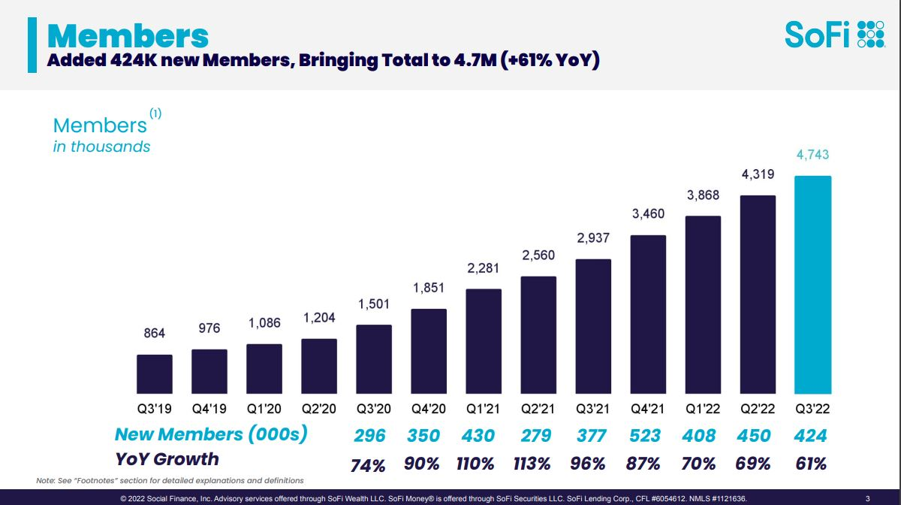

# SoFi Title here
---
**Overview and Origin of SoFi**
 
In 2011 four students the Stanford Graduate School of Business wanted to provide more affordable options for students who were accumulating student debt.  12 years later Sofi has done that and so much more.  Together, Mike Cagney, Dan Macklin, Ian Brady and James Finnigan began a pilot program to lend 100 students approximately $20,000 to help fund their education.  The birth of SoFi and it incorporation began in August 2011.
12 years later Sofi has done that and so much more.
 
Mike Cagney led the helm of Sofi until 

 

> ### As of Q3 2022 Sofi's Membership has grown 976K to **4.7 million** in less than 3 years.

Adendum  
[^1]: https://www.fool.com/investing/2021/07/02/why-sofis-leadership-is-a-company-strength/

[def]: \SoFi_Member.jpg\